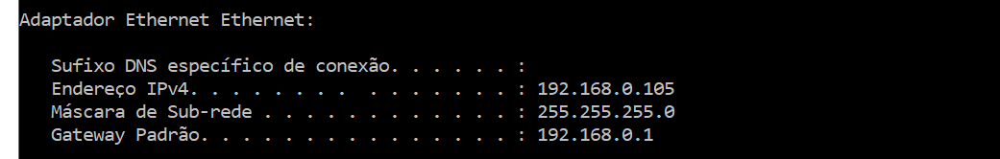

# ROCKETSEAT NEXT LEVEL WEEK - Pocket Mobile


Durante o Next Level Week - Pocket Mobile, feito pela Rocketseat em desembro de 2024, foi criado o aplicativo NearBy, utilizando NodeJS e ReactNative

## Instalação

Dentro da pasta /api, executar o seguinte comando pelo terminal

```npm install```

Para executar o backend

```npm start```

Uma vez iniciado o backend, será necessário instalar e executar a aplicação mobile.

Dentro da pasta /mobile, executar o seguinte comando pelo terminal

```npm install```

Será necessário editar o arquivo /mobile/src/services/api.ts. Neste arquivo é inserido o IP onde está sendo executado o backend. Você deve informar o IP de sua máquina e a porta 3333. Para obter o ID de sua máquina no Windows, pode ser utilizando o comando IPCONFIG no terminal



Uma vez editado o endereço do backend, a aplicação pode ser executada. Para executar, você pode primeiro instalar um emulador, ou testar direto no celular usando um aplicativo chamado EXPO GO. Uma vez instalado no seu aparelho, certifique-se de estar logado por WiFi na mesma rede onde o seu computador se encontra.

Com o EXPO GO rodando em seu aparelho, para executar a aplicação NearBy, execute o seguinte comando no terminal

```npm start --tunnel```

## MOBILE

A aplicação mobile foi feita com React Native usando Typescript e Expo. 

Para instalar o Mobile foi utilizando o seguinte comando dentro da pasta /mobile

```npm install```

Pode ser necessário no futuro atualizar o Expo. Para fazer isso os comandos são estes:

```npm install expo@latest```

```npx expo install --fix```

Para verificar se a aplicação está atualizada.

```npx expo-doctor```

Para rodar a aplicação no EXPO GO pode ser necessário liberar a porta do Firewall utilizada pelo Expo. Se você não quiser fazer isso, pode usar o seuinte comando.

```npm start --tunnel```

A estrutura da aplicação é a seguinte:

APP - Telas da aplicação
ASSETS - Imagens utilizadas pela aplicação
COMPONENTS - Componentes reaproveitados pela aplicação
SERVICES - Faz a conexão com o backend utilizando Axios
STYLES - Configurações de estilo, cores e fonte 
UTIL - Icones

Estrutura da tela inicial

```
import { View } from "react-native"
import { router } from "expo-router"

import { Steps } from "@/components/steps"
import { Button } from "@/components/button"
import { Welcome } from "@/components/welcome"

export default function Index() {
  return (
    <View style={{ flex: 1, padding: 40, gap: 40 }}>
      <Welcome />
      <Steps />

      <Button onPress={() => router.navigate("/home")}>
        <Button.Title>Começar</Button.Title>
      </Button>
    </View>
  )
}
```

A tela inicial utiliza 3 componentes, chamados steps, button e welcome. Como exemplo, vamos ver como foi estruturado o componente button.

```
import {
  TouchableOpacity,
  TouchableOpacityProps,
  Text,
  TextProps,
  ActivityIndicator,
} from "react-native"
import { IconProps as TablerIconProps } from "@tabler/icons-react-native"

import { s } from "./styles"
import { colors } from "@/styles/theme"

type ButtonProps = TouchableOpacityProps & {
  isLoading?: boolean
}

function Button({ children, style, isLoading = false, ...rest }: ButtonProps) {
  return (
    <TouchableOpacity
      style={[s.container, style]}
      activeOpacity={0.8}
      disabled={isLoading}
      {...rest}
    >
      {isLoading ? (
        <ActivityIndicator size="small" color={colors.gray[100]} />
      ) : (
        children
      )}
    </TouchableOpacity>
  )
}

function Title({ children }: TextProps) {
  return <Text style={s.title}>{children}</Text>
}

type IconProps = {
  icon: React.ComponentType<TablerIconProps>
}

function Icon({ icon: Icon }: IconProps) {
  return <Icon size={24} color={colors.gray[100]} />
}

Button.Title = Title
Button.Icon = Icon

export { Button }
```

## BACKEND

O backend é uma aplicação Node utilizando Express com Typescript. Para acessar o banco de dados sqlite foi utilizado o Prisma.

Para instalar

```npm install```

Para rodar a aplicação:

```npm start```

A aplicação vai estar disponível no endereço:

http://localhost:3333

Caminho do banco de dados: /prisma/dev.db

### Rotas da aplicação:

Endpoint                           | Metodo  
---------------------------------- | -------- 
/categories                        | GET      
/markets/category/:category_id     | GET
/markets/:id                       | GET
/coupons/:market_id                | PATCH

**/categories**

http://localhost:3333/categories

```[{"id":"146b1a88-b3d3-4232-8b8f-c1f006f1e86d","name":"Alimentação"}...]```

**/markets/category/:category_id**

http://localhost:3333/markets/category/146b1a88-b3d3-4232-8b8f-c1f006f1e86d

```
[{"id":"4197b830-aa9c-40d4-a22e-c05043588a77","name":"Burguer Up","description":"Hambúrgueres gourmet preparados na hora. Ingredientes frescos e combinações únicas.","coupons":10,"latitude":-23.56011117635681,"longitude":-46.65636680690605,"address":"Rua Peixoto Gomide - Jardim Paulista","phone":"(13) 98765-4321","cover":"https://images.unsplash.com/photo-1528605248644-14dd04022da1?w=400&h=300","categoryId":"146b1a88-b3d3-4232-8b8f-c1f006f1e86d"},
...]
```

**/markets/:id**

http://localhost:3333/markets/4197b830-aa9c-40d4-a22e-c05043588a77

```
{"id":"4197b830-aa9c-40d4-a22e-c05043588a77","name":"Burguer Up","description":"Hambúrgueres gourmet preparados na hora. Ingredientes frescos e combinações únicas.","coupons":10,"latitude":-23.56011117635681,"longitude":-46.65636680690605,"address":"Rua Peixoto Gomide - Jardim Paulista","phone":"(13) 98765-4321","cover":"https://images.unsplash.com/photo-1528605248644-14dd04022da1?w=400&h=300","categoryId":"146b1a88-b3d3-4232-8b8f-c1f006f1e86d","rules":[{"id":"40e46db1-fef3-4b67-9dd3-ebbec63a0302","description":"Disponível até 20/01/2025","marketId":"4197b830-aa9c-40d4-a22e-c05043588a77"},{"id":"b278beab-5bea-4893-aa1b-cd79b9713721","description":"Válido apenas para consumo no local","marketId":"4197b830-aa9c-40d4-a22e-c05043588a77"}]}
```

**/coupons/:market_id**

http://localhost:3333/coupons/4197b830-aa9c-40d4-a22e-c05043588a77
```
{
  "coupon": "921A441E"
}
```